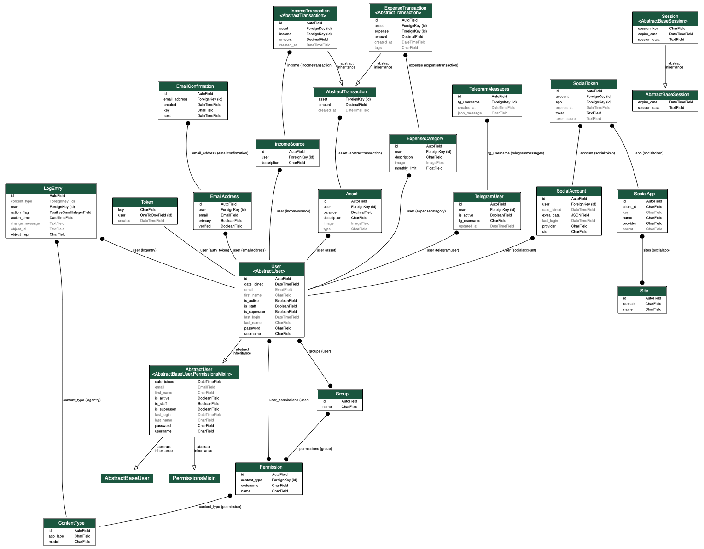
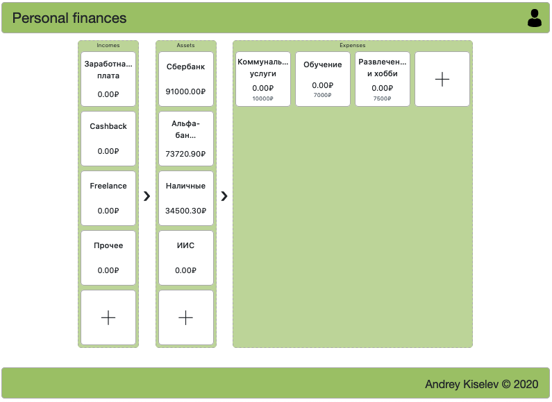
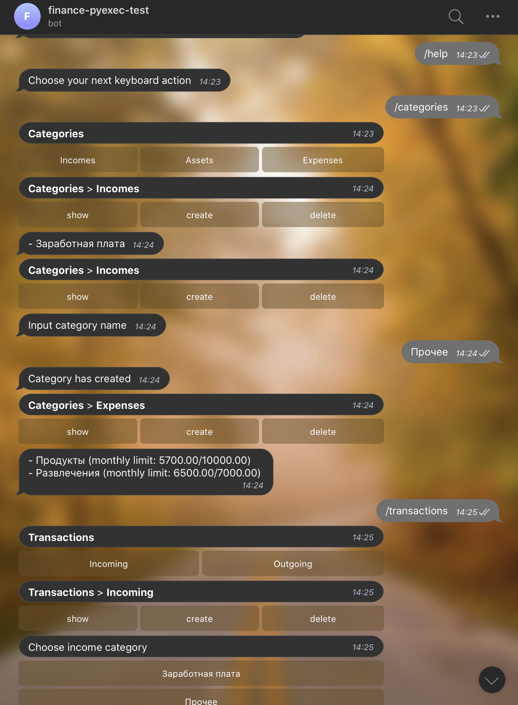

# Персональные финансы

Продукт, который помогает упорядочить расходы по соответсвующим категориям  
и проанализировать наиболее затратные их них.  
  
Как конечная цель: _оптимизация расходов пользователя_.

## MVP

- web-interface для возможности учета расхода финансов;
- telegram-bot, предоставляющий альтернативу web-интерфейсу.

## UML-модель

Основные узлы модели:

- пользователь сайта, как одновной объект, для которого сохраняются транзации и категории;
- список категорий и транзакций между ними;
- связь между пользователем сайта и аккаунтом в telegram (вынесено в отдельную таблицу);
- история команд пользователя для дальнейшей аналитики.

## Общая концепция проекта

В качестве базовой идеи — предоставление удобного интерфейса  
внесения доходов и расходов с подсчётом суммарного размера  
транзакций в течении каледнарного месяца (календарный месяц —  
базовый интервал агрегации сумм по категориям).

  
  
Ещё одним каналом взаимодействия с данными транзакций — telegram bot,  
который поддерживает тот же набор доступных действий, что и web-interface.

## Технические детали

Верстка сайта релизована с использование [vue.js](https://vuejs.org/) фрейморка, бекенд часть — [Django](https://www.djangoproject.com/) версии 3.  
Django, поскольку в 3 версии появилась асинхронность, запускается с помощью [daphne](https://github.com/django/daphne).  
  
Бот реализован на базе библиотеки [python-telegram-bot](https://github.com/python-telegram-bot/python-telegram-bot) и использованием polling-модели.  
Реализован как management-скрипт django и запускается с помощью django-admin.

## Альтернативы

| Название | Информация | Особенности |
|:--------:|:----:|:------------------:|
| CoinKeeper | about.coinkeeper.me | Очень удобное приложение контроля расходов. Без использования бота. |
| Мобс     | mobsbot.ru | Неплохие возможности бота. Без возможности внесения данных через сайт. |
| greenz   | greenzbot.ru | Реклама или абонентская плата при использовании сервиса. |
| budgetmoneybot | Рекламный пост на [habr](habr.com/ru/post/463969/) | Сканирование чеков. Есть абонентская плата. |

На самом деле отличных и достойных альтернатив очень много,  
кто-то предоставялет прилоежния, которые просто невероятны по своей функциональности  
(как CoinKeeper), но при этом нет возможности взаимодействия через telegram.  
У кого-то есть сайты и боты, но большинство хороших ресурсов платные.  
  
Поэтому основная цель продукта — создать __бесплатную открытую альтернативу__  
существующим продуктам, с дальнейшей возможностью расширения до того уровня,  
который приемлем для вас.
